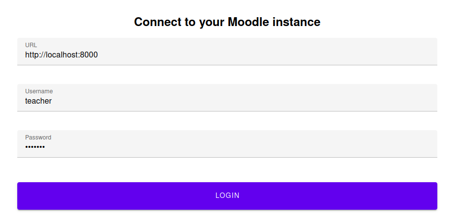
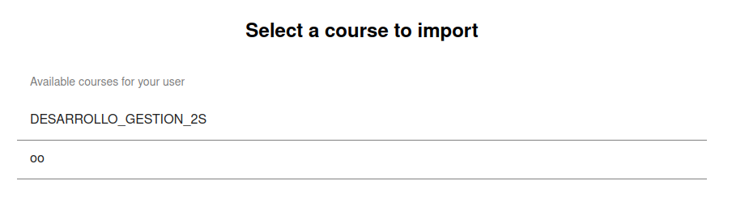
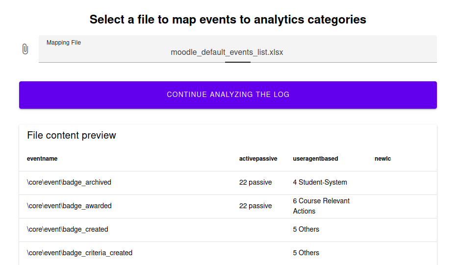
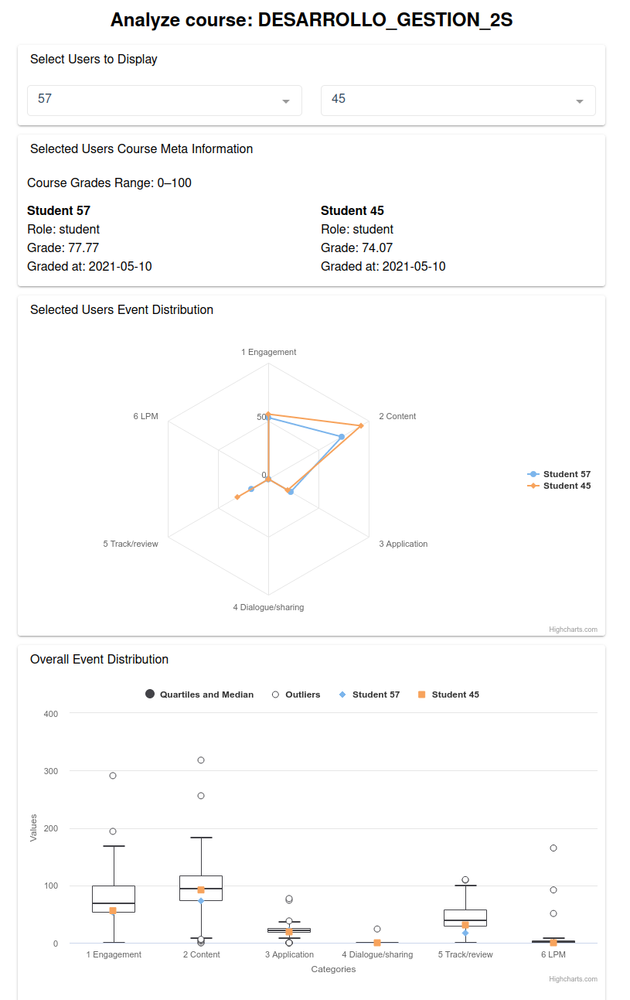

# Learning Analytics Web Application

The web application is built using [Vue3](https://vuejs.org/guide/introduction.html), [Vuetify](https://next.vuetifyjs.com/), and [HighCharts](https://www.highcharts.com/).

## Configure Moodle Instance

This tool works only with a accordingly configured Moodle instance. More concretly, you it needs the [ws_la_trace_exporter web service plugin](https://github.com/ugGit/moodle_ws_la_trace_exporter) installed. Therefore follow the setup instructions of before-mentioned plugin (allow creation of web service tokens, allow acces through REST API, etc.).

Once worked through, one additional configuration has to be done: Expose an external web service exposed with the following three functions:

- `gradereport_user_get_grade_items`
- `local_moodle_ws_la_trace_exporter_get_available_courses`
- `local_moodle_ws_la_trace_exporter_get_course_data`

Therefore, execute the following steps in your Moodle instance:

1. Access Site administration > Server > Web services > External services
2. Add a new custom service
3. Use _loganalyzer_ as short name
4. Tick the Enabled checkbox
5. Click Save Changes
6. Add the three before-mentioned functions to the web service

## Run the Application for Production

This can be used to test the web application locally as well as on a server, altough the docker environment used is not very sophisticated. More details to the dockerfile can be found here: https://v2.vuejs.org/v2/cookbook/dockerize-vuejs-app.html?redirect=true.

### Build the Docker Container

```
docker build -t vuejs-cookbook/dockerize-vuejs-app .
```

### Run the Docker Container

```
docker run -it -p 8080:8080 --rm --name dockerize-vuejs-app-1 vuejs-cookbook/dockerize-vuejs-app
```

Start using the application on http://localhost:8080 of the machine running the docker container! More instructions on how to use the application are given further down in this guide.

## Run the Application for Development

You will need [Node.js](https://nodejs.org/en/) and [npm](https://www.npmjs.com/) installed on your machine.

### Install Dependencies

```
npm install
```

### Compiles and Hot-Reloads for Development

```
npm run serve
```

Start editing the source code and check the changes on http://localhost:8080!

## Use the Application

The workflow consists of four steps:

1. Connect to the Moodle instance using a user which is enrolled in at least one course as _teacher_. Note that it does not work if the user is the _admin_ of the Moodle instance, because they can not issue web service tokens for security reasons.
   <br>
   
2. Select one course of the list for which data shall be imported.
   <br>
   
3. Select the mapping file that shall be applied to map _og events_ to _event categories_. Such a file can be found in this project folder under `/docs/moodle_default_events_list.xslx`.
   <br>
   
4. Use the analyzer to gain insights into the learning activity of your course!
   <br>
   
